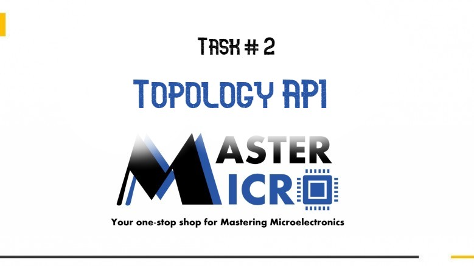

# Topology_API

  

<h3>-Go to Docs Folder & Choose Index.html to see the Full documentation as website created by Doxygen</h3>

## Overview
+ API includes mathods to:
  - parsing a topology JSON file and save it as a topology object.
  - write a topology from the resident set of topologies into a JSON file.
  - query on the resident set of topologies.
  - get the devices in a specific topology.
  - get the devices which are in a specific topology and connected to a specific netlistNode.
+ `Hint` A topology is a set of electronic components that are connected together.
+ Example JSON file (topology.json):
```ruby
{
  "id": "top1",
  "components": [
    {
      "type": "resistor",
      "id": "res1",
      "resistance": {
        "default": 100,
        "min": 10,
        "max": 1000
      },
      "netlist": {
        "t1": "vdd",
        "t2": "n1"
      }
    },
    {
      "type": "nmos",
      "id": "m1",
      "m(l)": {
        "default": 1.5,
        "min": 1,
        "max": 2
      },
      "netlist": {
        "drain": "n1",
        "gate": "vin",
        "source": "vss"
      }
    }
  ]
}
```

## Design Decisions
+ Choose C++ for this task as it provides an excellent environment for applying OOP concepts on it. 
In addition to, it supports a package called `Jsoncpp` which has a great methods and classes to deal with JSON files
+ Assume that the netlist for nmos, Pmos type must have drain, gate and source.
+ Assume that the netlist for resistor type must have t1 and t2.


## hierarchical structure of classes
  


## Some Screenshots
  
  

